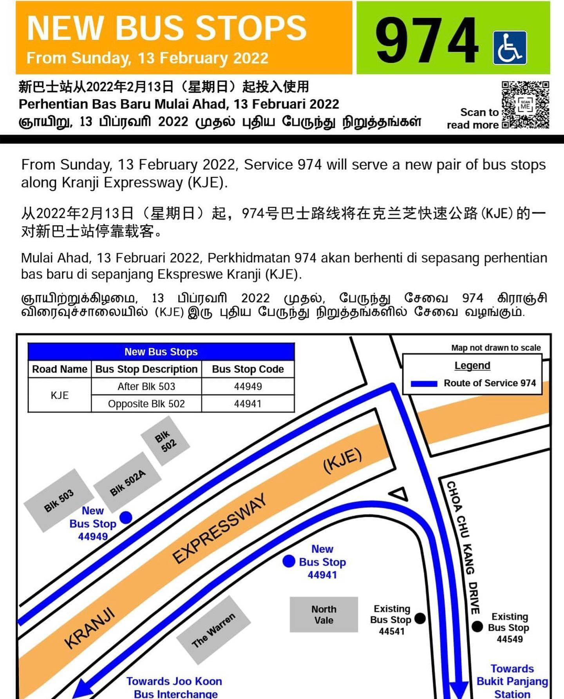
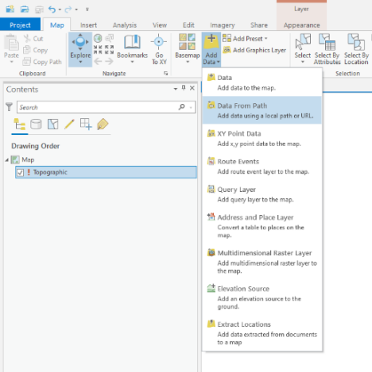
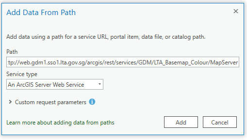
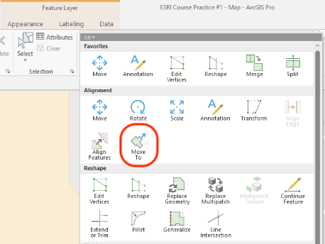
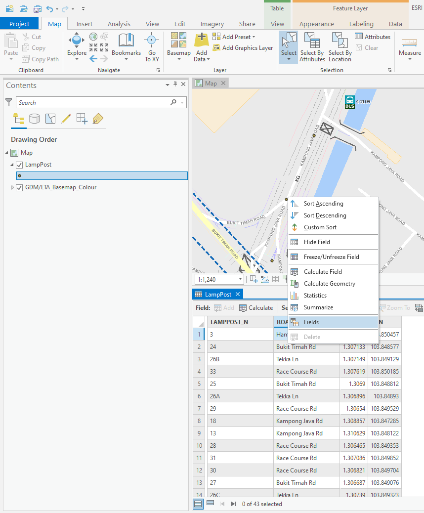

# Lab Practice #1

!!! abstract "Learning Objectives"

    In this lab exercise, you will learn the following:

    - Create a new feature class 
    - Data editing 
    - Peforming spatial analysis using geoprocessing tools

## Case Study

Read the case study below.

<iframe src="https://www.facebook.com/plugins/post.php?href=https%3A%2F%2Fwww.facebook.com%2FLawrenceWongST%2Fposts%2F491546678997483&show_text=true&width=500" width="500" height="560" style="border:none;overflow:hidden" scrolling="no" frameborder="0" allowfullscreen="true" allow="autoplay; clipboard-write; encrypted-media; picture-in-picture; web-share"></iframe>

In this lab, you will plot the location of the two new bus stops in a GIS dataset.

## 1.1 Adding a basemap

In this step you will create a new ArcGIS Pro and add a basemap.

1. Click the Start Menu, expand ArcGIS and click on **ArcGIS Pro** to launch the ArcGIS Pro client.

	!!! tip
		If a licence dialog box appears, alert one of the trainers to help you configure your ArcGIS Pro client to connect to LTA's on-premises licencing server.

1. Once ArcGIS Pro launches, under the middle column titled **New**, click on **Map**.

1. You will be prompted to enter a name for the new project. Enter `Lab1` and click **OK**.

	!!! info
		It will take a couple of minutes for ArcGIS Pro to create and open the project.

	!!! tip
		Take note of where your project will be stored under the *Location* field. By default, it will be stored at `C:\Users\<your WOG ID>\Documents\ArcGIS\Projects`. You will need to navigate to this directory in File Explorer to access the data and files that you create.

	When you first open a new map in ArcGIS Pro, you will only see a blank canvas. You will need to first add a _basemap_, which will serve as the foundation for your maps and provide context for your work.

	!!! warning "Using ArcGIS Pro in WOG machines"

		If you are using ArcGIS Pro from your WOG machine, do take note that you will not be able to access the basemaps provided by Esri due to firewall connectivity issues. You may however leverage on our in-house designed Ignite Colour basemap, which will be demonstrated in the following steps.

		If you access ArcGIS Pro from your Internet machine or the Internet-enabled Workstations in the DLab, you can use the basemaps provided by Esri.

	

	Next, we will add a basemap to your map.

1. Under the **Map** Tab and the **Layer** subgroup, click on the **Add Data** drop down menu.
1. Select **Data from Path**.
1. Enter the following path: `http://web.gdm1.sso1.lta.gov.sg/arcgis/rest/services/GDM/LTA_Basemap_Colour/MapServer`
1. Leave all other settings as default and click **Add**.
	The basemap will be added to the Contents pane on the left. 
1. Right click on the layer and click on **Zoom To Make Visible**. The basemap shoudl appear on the map.
1. Click on the **Save** icon at the top left or press `Ctrl + S` to save your project.

!!! info "Accessing Ignite Colour basemap from Internet machine"

    If you are accessing ArcGIS Pro from an Internet machine, do use this URL instead: `https://ignite.lta.gov.sg/arcgis/rest/services/Ignite_Basemap_Colour/MapServer`

## 1.2 Creating a new feature class

_Feature classes_ are homogeneous collections of common features, each having the **same spatial representation** (such as points, lines, or polygons) and **a common set of attributes** (for example, a line feature class for representing road centerlines). The four most commonly used feature classes are **points, lines, polygons, and annotation**.

In the illustration below, these feature classes are used to represent four datasets for the same area:

- Manhole cover locations as points
- Sewer lines
- Parcel polygons
- Street name annotation

Different feature class types can be used to represent different phenomena. Read the table below to learn more.

| Feature class type | Description |
| --- | --- |
| Points | Features that are too small to represent as lines or polygons as well as point locations (such as GPS observations). |
| Lines | Represent the shape and location of geographic objects, such as street centerlines and streams, too narrow to depict as areas. Lines are also used to represent features that have length but no area, such as contour lines and boundaries. |
| Polygons | A set of many-sided area features that represents the shape and location of homogeneous feature types such as states, counties, parcels, soil types, and land-use zones. |
| Annotation | Map text including properties for how the text is rendered. For example, in addition to the text string of each annotation, other properties are included such as the shape points for placing the text, its font and point size, and other display properties. Annotation can also be feature linked and can contain subclasses. |
| Multipatches | A 3D geometry used to represent the outer surface, or shell, of features that occupy a discrete area or volume in three-dimensional space. Multipatches comprise planar 3D rings and triangles that are used in combination to model a three-dimensional shell. You can use multipatches to represent anything from simple objects, such as spheres and cubes, to complex objects, such as iso-surfaces and buildings. |

In this step, you will create a feature class from an existing shapefile.

1. Open the Catalog Pane (if it is not already open). It should be docked on the right side of the application.
1. Click Folders in the Contents pane. 
1. Expand `Lab1`. That folder contains all the files in your ArcGIS Pro project.
	!!! tip
		Before creating a Feature Class, you need to first create a geodatabase, which is essentially Esri's proprietary data format for storing feature classes. By default, a geodatabase named `Lab1.gdb` should have already been created for you.
1. Right click `Lab1.gdb` and hover on *New > Feature Class*.
1. Under **Name**, enter `NewBusStop`.
1. Under **Feature Class Type**, select `Point`. Click Finish.

	The `NewBusStop` Feature Class will be added to your map. 
!!! question "What is the difference between a Feature class and a Shapefile?"

    When working with geospatial datasets, sometimes you might come across another common format known as the *shapefile*. It is a traditional Esri vector data storage format for storing the location, shape, and attributes of geographic features.

    Shapefiles are made up of a combination of related files containing at least the .shp, .shx, .dbf, and .prj files components, and usually packaged into a .zip file for easy sharing. A feature class on the other hand must be stored inside a geodatabase which in turn comprises of hundreds of small files.

    The shapefile is a format that is compatible with both ArcGIS products and open source GIS software such as QGIS. If you need to share GIS data with a colleague who does not have access to ArcGIS Pro, you should export it to a shapefile.

    Read more about shapefiles [here](https://doc.arcgis.com/en/arcgis-online/reference/shapefiles.htm).

## 1.3 Move a feature to a specified location

Next, you will use the Editor tool in ArcGIS Pro to create a bus stop feature a specific lat-lon coordinate.

!!! info "About the Move To tool"
	The Move To tool  moves selected features from the geometric center (centroid) of the selection set to a specified x,y,z location, an x,y,z distance from its current location, or a direction, 3D angular pitch, and distance. This tool is available in the Modify Features pane.

1. On the ribbon, click the Edit tab. In the Features group, click Create.
	The Create Features panel opens on the right.
1. Click on the `NewBusStop` feature template.
1. Click anywhere within the boundary of Singapore to place a point. 
1. On the ribbon, click the Edit tab. In the Features group, click **Modify** .
1. In the Modify Features pane, expand Alignment and click **Move To** .
	 
	

1. In the tool pane, click the **Select tool**  and select the point you've just created.

1. In the **Move To** tool, under the **Method** section, choose **Absolute** and enter the following coordinates:

	- Longitude: 103.7438077
	- Latitude: 1.3884430

1. Repeat the previous five steps to add a point at this location:

	- Longitude: 103.7440424
	- Latitude: 1.3893283

1. Under the **Edit** Tab and **Manage Edits** Group, click on **Save** to save your edits.

!!! tip
	If you are creating or digitising a large number of features, remember to click the **Save** button regularly to avoid losing your changes.

## 1.4 Adding a new field

Next, you will add a new field to the feature class to store the bus stop number for these bus stops.

!!! info "A primer on fields"

	Fields are the components that provide structure for a table. Tables form the foundation of geographic data and are the fundamental building blocks of any data model. Tables are a collection of information, such as a list of building owners, employees, or customer information. Layers in a map, such as city streets, buildings, or address points, are essentially tables that include information about the geometry and location of those features.

1. To open the fields view, first highlight the lamp post layer in the **Contents pane**. This displays the Feature Layer tabs.
1. Clicking the Data tab, you will find the Data Design group containing the Fields, Subtypes, and Domains buttons. These are your tools for working with a data model.
1. Click the **Fields** button to open the fields view, which displays the layer's fields in a tabular arrangement.

	

!!! tip "Accessing the fields view"

	You may also access the fields view by opening the Attribute Table (right click the layer in the Contents Pane and click **Attribute Table**) and then right clicking any column in the Attribute Table and selecting **Fields**.

	

The  Fields view allows you to manage the fields associated with a layer or table. As shown in the examples below, you can edit a layer's or table's fields, modify their properties, delete fields, or create fields using the Fields view.

| Example | Description |
| --- | --- |
| 1 | Change the name and alias of a field. |
| 2 | Delete unnecessary fields. |
| 3 | Add a new field called BLDGTYPE to store the type of campus building.|
| 4 | Apply a domain to a field.|
| 5 | Apply a default value to a field.|

1. Click the last row to add a new field.
1. Enter the following properties to the new field:

	- Field Name: `BUS_STOP_NUM`
	- Alias: `Bus Stop No`
	- Data Type: `Text`

1. Save your changes. On the **Fields** tab, in the **Changes** group, click **Save**.

	

1. Open the Attribute Table of the `NewBusStop` layer by right clicking the layer in the Contents pane and click **Attribute Table**. 
	
	The Attribute Table opens at the bottom of the application.

1. Double click on a cell to add the Bus Stop number for both of the new features.

!!! tip
	You may double click on a row in the Attribute Table to select and zoom to that particular feature.

!!! info
	For more information on Creating and managing fields, refer to the documentation at [https://pro.arcgis.com/en/pro-app/latest/help/data/geodatabases/overview/create-modify-and-delete-fields.htm](https://pro.arcgis.com/en/pro-app/latest/help/data/geodatabases/overview/create-modify-and-delete-fields.htm).

## 1.5 Spatial Analysis

You want to see the spatial extent of this bus stop can improve connectivity for nearby residents. You can leverage on the buffer tool to do this.

1. Under the **Analysis** Tab and **Geoprocessing** Group, click on **Tools**.
	The Geoprocessing panel appears at the right.
1. Enter `Buffer` in the *Find Tool* text field.
1. Click on the **Buffer (Analysis Tools)** tool.
1. Under **Input Features**, select `NewBusStop`
1. Under **Distance**, enter 400 meters.
1. Leave all the other settings as it is and click on **Run**. Two buffer rings should be created around the two point features you've just created.

!!! tip
	If you have selected any feature or highlighted any feature in the Attribute Table, the buffer tool (or any geoprocessing tool) will only perform the analysis on the selected features.

	To apply the (buffer) tool on all the features in the feature class, go to the Edit Tab, under Selection group click on **Clear**. This will clear the existing selection of features.

Congratulations! You have completed this lab assignment. 